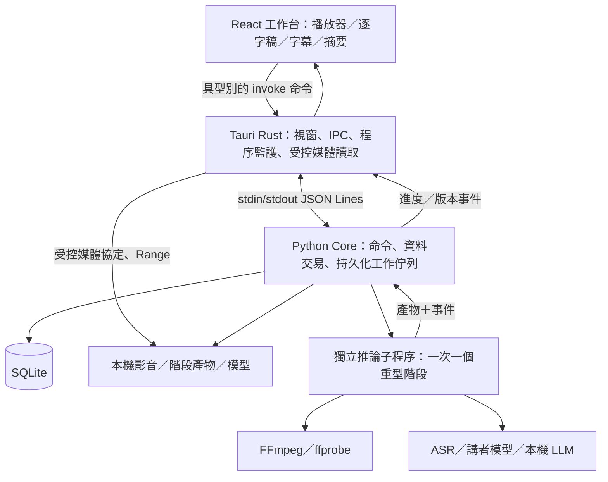

# Transcript Plus：跨平台單機架構

日期：2026-09-29｜狀態：建議設計，需通過 G0 技術驗證。功能範圍以 [MVP](MVP.md) 為準。

## 1. 決策摘要

採 **Tauri 2 + React／TypeScript + Python sidecar + SQLite + 本機模型**。前端編譯為靜態資源；Rust 處理桌面生命週期與受控檔案存取；Python 負責轉錄、講者、摘要、字幕規則與資料交易。使用者安裝完成後不需準備開發環境。

這是基於現有 Python AI 程式與新字幕介面需求的工程判斷。Tauri 官方支援搭配 PyInstaller 等方式封裝外部程式，但各平台仍須驗證依賴與打包。[Tauri sidecar 官方文件](https://v2.tauri.app/develop/sidecar/)

| 選項 | 評估與決策 |
|---|---|
| Tauri + Web UI + Python | 採用；桌面職責與 AI 職責清楚，無須改寫成熟 Python 推論套件。代價是 Rust、WebView 及 sidecar 三者整合。 |
| Electron + Web UI + Python | G0 備案；若 Tauri 媒體協定或 WebView 差異無法在時限內解決，再評估改用 Electron，須重新量測記憶體與發行包。 |
| Python + Qt | 可行，但現有 Web 介面經驗與文字編輯元件較容易用於新工作台，暫不採用。 |
| FastAPI + 系統瀏覽器 | 適合內部工具；不足以單獨完成此次桌面視窗、程序管理與安裝體驗。 |
| 全 Rust／C++ AI 核心 | 首版不採，避免同時移植模型流程與建立產品。 |

新介面採 React + Vite；不需要 Next.js 的伺服器渲染。FABO Angular 介面僅參考互動與測試案例，不整包移入。若團隊實際以 Angular 為主，可在 G0 改用靜態 Angular，Python 與桌面協定不受影響。

## 2. 模組與程序



| 層 | 責任 | 邊界 |
|---|---|---|
| UI | 編輯、可視狀態、播放器、虛擬清單、鍵盤操作 | 不直接操作 SQLite、任意檔案或啟動執行檔。 |
| Desktop Host | 選檔／匯出對話框、檔案 grant、模型下載、單一實例、sidecar 監護、OS 整合 | 不放轉錄及字幕業務規則。 |
| Python Core | 專案／版本／字幕／摘要服務、SQLite 唯一寫入者、工作排程與模型註冊 | RPC 接收與事件回傳不被推論阻塞；耗時工作放子程序。 |
| Inference Worker | 執行單一階段，輸出結構化結果至暫存區 | 不直接修改正式逐字稿；由 Core 驗證並原子提交。 |
| Provider adapter | ASR、Diarization、Summary 可替換介面 | 輸出統一資料契約，不將引擎特有 segment 格式洩漏到 UI。 |

Core 與 UI 不開 HTTP API；本機摘要若使用 llama-server，僅限 Core 內部呼叫，按需啟停。未來若要 API 整合，另設 adapter。

## 3. AI 與影音管線

```text
匯入原檔副本 → ffprobe 檢查 → 抽音／時間軸正規化
→ 16 kHz mono PCM → VAD／ASR → 原始 transcript snapshot
→ 講者分離（選用） → 可編輯 transcript revision
→ 字幕規則引擎 → 字幕版本 → SRT／VTT
→ 本機摘要（按需） → 引用驗證 → 摘要／決策／待辦
```

原始媒體保留；所有時間以「專案播放起點」的整數毫秒表示。記錄容器起始 PTS、選用音軌、音軌偏移及抽音轉換。VAD 不可把去除靜音後的時間當成播放時間；若串接語音島，保留每島映射。聲音與畫面起始不同、可變影格率、負 PTS 都列入媒體測試。

不預設套降噪或大幅音量處理，以免損害語音特徵；如新增，保留版本與可回復原始音訊。長檔解碼採串流或受限區塊，避免沿用整檔讀入多份 numpy 陣列的方式。

| 能力 | 首版候選與落地方式 |
|---|---|
| ASR | faster-whisper CPU INT8 作雙平台基線，先測 multilingual small；Breeze 等繁中模型列品質比較候選。模型 ID、revision、授權與 hash 在 G0 鎖定，不僅選套件名稱。 |
| Apple Silicon 加速 | 參考 FABO 的 MLX adapter；僅在詞時間、品質、記憶體與封裝通過後提供，CPU 基線仍保留。 |
| 字詞時間 | 直接取引擎輸出並驗證；不是所有中文詞組都能精確拆成單字。無 confidence 時存 null，不造出數值。 |
| 講者 | 參考 sherpa-onnx + segmentation／embedding；先做匿名 diarization。模型來源、版本、跨平台可封裝性及可散布條件須在 G0 驗證。 |
| 摘要 | llama.cpp／llama-server 加一個通過繁中測試的量化 GGUF 指令模型，先以 3B～4B 級做資源實驗；確切模型未定，不能沿用 FABO 配置就推定可交付。 |
| 字幕切分 | 本機確定性規則；首版不為每次換行呼叫 LLM。 |
| 解碼與播放 | FFmpeg／ffprobe 隨包，播放由 WebView 執行；codec 不支援時製作可播放代理檔，保持同一專案時鐘。 |

faster-whisper 官方提供 CPU INT8、VAD 與 word timestamps 用法；這支持選為候選，但不代表本產品在目標電腦已達品質或速度要求。[官方實作說明](https://github.com/SYSTRAN/faster-whisper)

播放器不假定所有 MOV／MP4 皆原生可播。G0 決定可散布的 FFmpeg build 與代理 codec，實測 WKWebView／WebView2；先確保音訊預覽，再完成影片代理。代理檔產生失敗要保留轉錄結果並明示影片預覽不可用，不能顯示成功空畫面。

## 4. 資料契約與儲存

結構化 Transcript 為領域核心，SQLite 是唯一可寫事實來源，JSON 是版本快照與交換格式。SRT／VTT 為衍生輸出，不拿字幕檔回寫當主資料庫。

| 實體 | 主要欄位 |
|---|---|
| Project／Asset | UUID、標題、來源 hash、相對檔案位置、duration_ms、codec、選用音軌、時間映射 |
| Job／Stage | job_id、kind、attempt、status、stage、input_revision、input_hash、model_hash、parameters_hash、artifact_hash、error_code、heartbeat |
| TranscriptRevision | transcript_id、revision、schema_version、parent_revision、建立時間、來源快照 |
| Segment | 穩定 UUID、start_ms、end_ms、raw_text、edited_text、speaker_id、word_ids、alignment_status、review_reasons |
| Word | 穩定 UUID、raw_text、start_ms、end_ms、confidence（nullable）、provider、alignment_revision |
| Speaker／Turn | 專案內 speaker UUID、display_name、manual_confirmed；turn 的 start／end 及群組；允許重疊與 unknown |
| CaptionTrack／Cue | track_revision、source_transcript_revision、preset、cue UUID、source_word_ids、文字來源範圍、text、start_ms、end_ms、timing_status、manual_override |
| Summary／Item | source_revision、model_hash、prompt_version、kind、text、owner、due_date、due_text、citations、stale |
| ModelInstall | 模型 ID、版本、用途、檔案 hashes、runtime、授權資訊、安裝狀態 |

示意片段（非完整 schema）：

```json
{
  "schema_version": 1,
  "transcript_id": "tr_01",
  "revision": 3,
  "duration_ms": 120000,
  "segments": [{
    "id": "seg_01", "start_ms": 1200, "end_ms": 2600,
    "raw_text": "下週上線", "edited_text": "下週上線",
    "speaker_id": "spk_01", "alignment_status": "valid",
    "word_ids": ["w_01", "w_02"]
  }],
  "words": [
    {"id": "w_01", "raw_text": "下週", "start_ms": 1200, "end_ms": 1800, "confidence": null},
    {"id": "w_02", "raw_text": "上線", "start_ms": 1900, "end_ms": 2600, "confidence": null}
  ]
}
```

時間必須有限、落在媒體範圍內；詞界無法驗證就標記 incomplete。不同講者 turn 可重疊；首版單一字幕軌不允許重疊，衝突交由使用者決定合併呈現或手動調整，不默默丟棄另一位講者文字。

SQLite 採 foreign keys、WAL、短交易、busy timeout 與版本化 migration；Core 序列化寫入。大型波形、音訊、模型不入 DB。產物先寫 `.partial`、校驗、rename，再用短交易登記；啟動清理未被引用的暫存，避免 DB 指向半份檔案。

資料位置：macOS `~/Library/Application Support/TranscriptPlus/`；Windows `%LOCALAPPDATA%\TranscriptPlus\`。初版固定使用本機磁碟，不支援在網路或同步磁碟上直接開啟 SQLite。

```text
TranscriptPlus/
  app.sqlite3
  projects/<project-id>/original/   # 原檔副本，不依賴使用者原路徑
  projects/<project-id>/derived/    # 音訊、播放代理、波形
  artifacts/<job-id>/<stage>/      # 可驗證的階段結果
  models/<model-id>/<revision>/
  backups/
  logs/
  tmp/
```

匯入前預估原檔副本、PCM、代理檔與安全餘裕；16 kHz／16-bit／mono PCM 每小時約 115 MB（十進位），模型與影片代理另外計算。磁碟不足時停止新增階段、保留前次成果。刪除專案先取消相關工作，再刪 DB 與檔案；不刪使用者外部原始檔。

## 5. 文字、字幕與時間一致性

1. 每次編輯帶 `expected_revision`；不符回 `REVISION_CONFLICT`，UI 保存草稿並提示重新載入，不覆蓋新版本。
2. 保留原始詞序與模型輸出。純標點／空白修改可保留詞界；詞彙插入、刪除、替換將影響範圍標為 `dirty`，保留句級播放時間，但不提供假精準逐詞高亮。
3. 在有效詞界拆句，新 cue 的起訖取對應首詞／末詞；例如兩詞時間為 1200～1800 與 1900～2600，拆後保持中間 100 ms 停頓，不平均分配時長。
4. 在多字詞內拆句缺少依據時，要求手動選時間或保持該詞完整。不得依字數比例宣稱完成對齊。
5. 修改逐字稿文字使相依 cue 變 stale；顯示受影響清單、提供重產生。手動 cue 先保留，替換前可比較及確認。
6. 字幕頁改字透過相同領域命令更新逐字稿來源範圍；首版不提供與逐字稿內容獨立的第二套文字。換行、cue 拆合、顯示時間則屬字幕軌，另增 track revision。
7. 文字、講者或來源時間變更使摘要 stale；引用保留舊 revision，不能直接跳到新稿的錯誤內容。可查看舊來源或重產生。
8. 復原／重做寫新 revision，保留本次編輯歷史；首次實作限定當前編輯工作階段，重開後仍保留已儲存最新版，不承諾跨重啟完整 undo stack。

每軌記錄依賴 revision；UI 未儲存時先保存再匯出。無效或衝突時間阻擋字幕匯出；僅閱讀速度等樣式警示可確認後匯出。使用者人工確認的時間標成 `manual`，不得偽裝成模型對齊成功。

## 6. 背景工作與復原

狀態：`queued → running → completed`；例外為 `cancelled / failed / interrupted`。每個 stage 可標 `pending / running / completed / skipped / failed / interrupted`。排程器一次只執行一個重型推論階段，ASR、講者及 LLM 不同時常駐；正常 UI 與檔案讀取不受影響。

- `import → preprocess → asr → diarization → captions` 可分階段提交；摘要為獨立工作，綁定已儲存 revision。
- ASR 完成就可校對；後續講者／摘要若來源 revision 已改變，只保存為候選結果，不能蓋掉人工修改。
- 每階段完成產物校驗後才提交 completed。重試建立新 attempt，僅重用媒體 hash、輸入 revision、模型 hash、參數與演算法版本全相符的階段。
- 首版做到階段重用，未完成的 ASR 仍整個 ASR 階段重跑；不把 FABO 現有中斷處理描述為分塊續跑。
- 取消先發 cooperative cancel，逾時停止子程序樹；取消中的工作不得再提交完成。提交時檢查 attempt token 和狀態。
- 啟動需取得單一實例鎖，再將前次 running 改 interrupted；排隊工作可恢復，重型中斷工作等待明確重試。
- Windows 用 Job Object 管理整個程序樹；macOS 用 process group 加 supervisor／控制管線 EOF 監護。僅追蹤本次建立的程序，不用程序名稱批次殺其他服務。
- 睡眠期間暫停有效運算計時，喚醒先檢查子程序與模型狀態；核心逾時依可觀測心跳／活動時間處理，不單看牆鐘六小時。

進度事件包含 `job_id、attempt、sequence、stage、processed_ms、total_ms、elapsed_ms`；無分母時 UI 顯示階段與耗時。事件可能遺失，重新連線必須可取得完整工作快照。

## 7. IPC 與媒體存取

Host 用已封裝執行檔的絕對路徑啟動 Core；透過 pipe 傳入資料目錄與協定版本。stdout 專供 JSON Lines，stderr 為日誌。訊息需含 `protocol_version、request_id、method、params`；回應與事件不同 envelope，設最大訊息長度。大量逐字稿分頁／區段取用，影音不走 base64 IPC。

主要命令：`project.import/list/get/delete`、`job.start/cancel/retry/get`、`transcript.read/apply_edit`、`speaker.rename/assign/merge`、`caption.generate/edit/validate`、`summary.generate/get`、`export.write`、`model.list/import/verify`。錯誤碼至少含 `MODEL_MISSING、UNSUPPORTED_CODEC、DISK_FULL、OUT_OF_MEMORY、REVISION_CONFLICT、INVALID_TIMING、WORKER_CRASHED`。

UI 只能提交桌面選檔產生的 grant ID；Host 在使用時驗證實際 canonical path、拒絕越界與不符合用途的連結。匯出同樣使用目的地 grant，不開放前端任意路徑寫入。媒體協定接受 project／asset ID 並解析到專案內檔案，支援 Range／HEAD、正確 MIME 和大檔串流。G0 必須實測雙 WebView 的 seek 行為。

限制 Tauri capability、禁止任意 shell 執行，UI 不載入遠端頁面／CDN，CSP 不放寬成任意來源。應用程式無本機帳密，但仍需遵守 OS 使用者存取權限；資料預設未應用層加密，依賴 OS 磁碟加密，不宣稱可抵禦同帳號惡意程式。

摘要服務僅綁定 loopback 的動態埠並使用隨機 API token；token 經受控程序介面傳遞、不寫日誌。關閉 proxy、redirect 與遠端 endpoint。摘要與轉錄內容不執行外部指令；所有引用必須核對保存版本中的原文。長稿依 token 預算分塊、分塊摘要再整合，保留來源 ID；格式修復最多有限次，失敗顯示明確錯誤而不是無限重試。

## 8. 模型與套件交付

程式包包含 UI、Host、封裝 Python runtime、worker、FFmpeg 及必要原生函式庫。模型採獨立包，可隨離線交付材料一起提供，也可經使用者主動下載；推論階段設定離線模式，禁止缺檔時自行抓取。

模型 manifest 包含 model ID、用途、上游來源與 revision、各檔 SHA-256、大小、runtime 相容版本、平台／架構、授權文字及安裝 schema。下載可續傳，完成後驗 hash 再原子啟用；匯入包防止路徑穿越與超額解壓，舊模型在工作結束前不刪除。

G0 建立可散布元件清單，逐項記錄 Python 套件、模型權重、轉換後模型、FFmpeg build／編碼器、llama.cpp 與附帶字型。套件可用不代表模型權重可再散布；若某模型無法隨包交付，改用可交付候選或明示使用者自行取得流程，再更新離線包驗收。此文件不作法律合規結論。

## 9. macOS 與 Windows 發布

共用原始碼，但產出各平台原生套件。PyInstaller 官方要求依目標作業系統分別建置，因此 CI 使用 Windows x64 與 macOS arm64 runner，不用一台 Mac 直接產出全部 Python 發行檔。[PyInstaller 文件](https://pyinstaller.org/en/stable/usage.html)

| 平台 | 發行產物 | 必驗事項 |
|---|---|---|
| macOS Apple Silicon | `.app` 放入 `.dmg` | Python 原生模組、Metal 資源與 sidecar 為 arm64；簽章所有內嵌程式／dylib，完成 notarization 與 stapling，再以正常下載檔驗證 Gatekeeper。 |
| Windows x64 | NSIS `setup.exe`；MSI 延後 | 打包必要 VC runtime；WebView2 缺少時提供離線安裝路徑；測非管理員使用、中文與空白路徑、DLL 搜尋及防毒環境。 |

Tauri 提供 Windows NSIS／MSI 與 WebView2 部署選項；首版選 NSIS，離線發行材料包含所需 WebView2 安裝資源。公開版本進行 Windows 程式碼簽章，簽章不保證一定沒有 SmartScreen 提示。[Windows 安裝官方文件](https://v2.tauri.app/distribute/windows-installer/)

macOS 公開發行採 Developer ID 簽章與公證；不以要求一般使用者關閉安全設定作為標準安裝流程。[macOS 簽章官方文件](https://v2.tauri.app/distribute/sign/macos/)

Python 先採 PyInstaller onedir。Tauri `externalBin` 登記入口，相關 `_internal`、原生庫及資料作資源一併封裝，保持相對位置；只帶一個 exe 不足以運行。冷啟動不得依賴當前工作目錄。程式入口須顯式區分 Core 與 `--worker`，不能照搬 frozen 環境中的 `sys.executable -m backend.worker`。

每次 CI：鎖定依賴→單元／契約測試→前端編譯→平台 Python 打包→桌面整合→簽章與安裝包→乾淨機冒煙。大型模型可在 CI 用小樣本模型測接線，但發布門檻必須另測實際交付模型與完整長檔。

升級前停止工作並用 SQLite backup API 建一致備份，不能只複製仍有 WAL 的主 DB。migration 在交易中執行，失敗保留舊資料與備份；新版 DB 不交給不支援的舊程式開啟。初版手動下載安裝新版。解除安裝預設保留使用者資料，清除資料須獨立明確選擇。

## 10. 建議程式目錄與測試

```text
apps/desktop/src/                 # React UI
apps/desktop/src-tauri/           # Rust Host、capabilities、資源設定
packages/contracts/              # schema、協定與共用測試樣本
core/transcript_plus/domain/      # transcript、caption、revision
core/transcript_plus/services/    # jobs、project、summary、model registry
core/transcript_plus/adapters/    # ASR、講者、LLM、媒體
core/transcript_plus/storage/     # repository、migrations
core/transcript_plus/entrypoints/ # core RPC／worker frozen 入口
packaging/                       # 各平台 PyInstaller 與 installer 設定
tests/fixtures/                  # 可公開或取得授權的測試素材
docs/
```

優先測試：字幕拆合與 edit invalidation 的性質測試、SRT／VTT 時間解析往返、revision 衝突、摘要引文與過期處理、程序崩潰及 retry idempotency、磁碟不足／壞模型／路徑越界。兩平台端對端以實際安裝包完成 [MVP 驗收](MVP.md#5-驗收與產品指標)，不以開發模式能啟動取代安裝驗收。

最大風險依序為本機模型品質與記憶體、字詞時間可用度、跨平台原生依賴封裝、影片播放差異。G0 先驗證這四項，再大量建置 UI。Intel Mac、Windows ARM 只有新增獨立建置與完整驗收後才列入支援。
