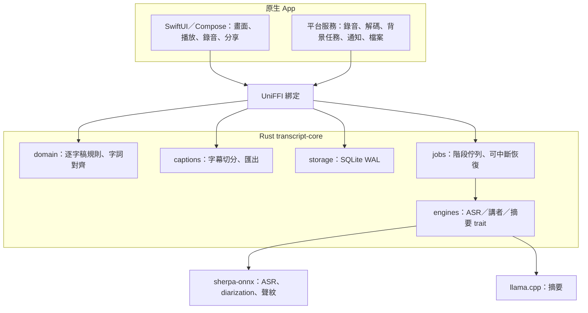

# Transcript Plus 行動版（iOS／Android）：獨立 App 架構

日期：2026-10-07｜狀態：已決策，核心骨架已建立。取代先前「桌面遙控」草案；行動版是**獨立產品**，功能對齊桌面版，但完全在手機上離線執行，不依賴桌面。UI 設計見 [MOBILE-UI.md](MOBILE-UI.md)。

## 1. 決策

| 項目 | 決策 | 理由 |
|---|---|---|
| 產品關係 | 獨立 App，與桌面僅共用「專案檔格式」 | 使用者不需擁有桌面版；資料不離開手機。 |
| 共用邏輯 | **Rust 核心**（`core/rust`，crate `transcript-core`） | 手機不能跑 Python 或啟動子程序；Rust 可靜態連結 sherpa-onnx／llama.cpp／whisper.cpp，iOS 與 Android 共用同一份領域規則。 |
| UI | **原生 UI**：iOS 用 SwiftUI，Android 用 Jetpack Compose | UI 要重新設計並符合各商店的平台規範；現有 React 介面是桌面版面，重用價值低。 |
| 橋接 | UniFFI 產生 Swift／Kotlin 綁定 | 型別安全，避免手寫 JNI／C 介面。 |
| 順序 | **先 iOS，再 Android** | 目前開發機已有 Xcode，尚無 Android SDK；iOS 硬體規格較一致，利於先量測模型表現。 |
| 桌面版 | 維持 Tauri＋Python，不受影響 | 長期可評估桌面也改用 Rust 核心，非本階段目標。 |

> 若團隊更想「一套 UI 兩平台」，可改用 Flutter 或 Compose Multiplatform，Rust 核心不需變動，只換 UI 層與橋接。這是唯一會牽動工期與人力的決策，建議在 M0 結束前定案。

## 2. 為什麼不能沿用現有核心

| 桌面現況 | 行動版替代 |
|---|---|
| Python＋PyInstaller sidecar | Rust 核心，同進程呼叫 |
| faster-whisper（CTranslate2）／MLX | **whisper.cpp（GGML）為主**：社群已有 Breeze-ASR-25 的 GGML 量化版與 Core ML 編碼器，不必自行轉換；sherpa-onnx 的 Whisper 路線為備案（其 iOS 版需自行從原始碼建置） |
| sherpa-onnx（Python 套件）講者分群 | 同一函式庫的 iOS／Android 原生建置，沿用 segmentation＋TitaNet／ERes2Net 模型 |
| llama-server 子程序 | llama.cpp 以函式庫連結，不開本機 server（iOS 不允許常駐子程序） |
| FFmpeg／ffprobe 子程序 | iOS AVFoundation／AVAssetReader；Android MediaExtractor／MediaCodec，輸出 16 kHz mono PCM |
| 使用者自選模型資料夾 | App 內「模型管理」：使用者主動下載、hash 驗證、可刪除 |
| 桌面檔案對話框 | 系統文件選擇器、分享表單、相簿／檔案 App 匯入 |

Breeze ASR 目前桌面用的是 CTranslate2／MLX 格式，不能直接在手機使用；改用社群已轉好的 GGML 量化版（見 §9 實測）。轉換版的來源、授權與雜湊須在發行前自行驗證。

## 3. 架構



原則：

- **平台層只負責「取得 PCM、顯示、系統整合」**；轉錄、版本、字幕規則全在 Rust，兩平台行為一致。
- 引擎以 trait 隔離（`AsrEngine`、`DiarizationEngine`、`SummaryEngine`），模型或函式庫更換不影響 UI。
- 沿用桌面的契約：整數毫秒、revision 與 `expected_revision`、`REVISION_CONFLICT` 等錯誤碼、`user_version=2` 的 SQLite schema，使專案可由匯出檔在桌面與手機之間搬移。
- 重型階段一次一個（ASR → 講者 → 摘要），記憶體吃緊時依序載入、用完釋放。

## 4. 行動端特有的設計要求

| 問題 | 設計 |
|---|---|
| iOS 背景會被暫停或終止 | 每個階段以「分塊」為單位提交（例如 30 秒音訊一塊，結果即寫入），被殺掉後從最後一塊續跑；這比桌面「整個 ASR 階段重跑」的要求更高。進行中使用前景並保持螢幕喚醒選項；長檔使用 `BGContinuedProcessingTask`（iOS 26+）等系統機制時需以真機驗證，不能假設穩定。Android 使用 Foreground Service（type 為 `dataSync` 或 `mediaProcessing`，依目標 API 要求）。 |
| 發熱與電量 | 轉錄前顯示預估時間與電量警示；低電量模式或高溫時暫停並提示；提供「僅充電時處理」選項。 |
| 記憶體 | 偵測可用記憶體選擇模型（如 small／base）；載入失敗回報 `OUT_OF_MEMORY` 並建議較小模型，不閃退。 |
| 儲存空間 | 模型（數百 MB～數 GB）與錄音很大；匯入前預估，不足則阻擋並說明；模型管理頁顯示各模型大小、可刪除。 |
| 錄音 | App 內錄音以 AAC／WAV 邊錄邊寫入，來電、耳機切換、被系統中斷時保存已錄內容。 |
| 安裝包大小 | 模型不隨 App 打包，首次使用時下載（可續傳、Wi-Fi 預設）。注意下載的是「資料」，不得下載會改變 App 功能的可執行程式碼（Apple 2.5.2）。 |

## 5. 倉庫結構

```text
core/
  transcript_plus/      # Python 核心（桌面，現況）
  rust/                 # 行動共用核心（已建立）
    src/domain.rs       #   已移植：驗證、編輯、字詞對齊
    src/export.rs       #   已移植：TXT、字幕換行；SRT/VTT 待字幕引擎
    src/storage.rs      #   已移植：schema v2、migration、中斷恢復
apps/
  desktop/              # Tauri 桌面（現況）
  ios/                  # SwiftUI + MVVM 骨架（假資料）；`xcodegen generate` 產生 Xcode 專案
  android/              # Compose + ViewModel/StateFlow 骨架（假資料）；尚未建置驗證
docs/
```

根目錄的 `Cargo.toml` 為 workspace；桌面的 `apps/desktop/src-tauri` 維持獨立，互不影響。

驗證指令：

```sh
cargo test -p transcript-core
```

目前 11 項測試通過（驗證、標點編輯保留對齊、字詞編輯失效、手動講者、Python 欄位來回保留、時間戳、換行、schema 版本與單一作用中工作、中斷恢復）。**這只證明已移植的規則行為正確，不代表行動版功能完成。**

## 6. 移植清單與驗收

移植以 `tests/` 內 Python 測試為準，逐項對照；每移植一個模組就補上等價的 Rust 測試。

| 模組 | 狀態 | 備註 |
|---|---|---|
| domain（驗證、編輯、word_spans） | 已完成 | |
| storage（schema、recover） | 已完成 | 專案／工作／歷史的 CRUD 與 revision 衝突尚未移植。 |
| export（TXT、wrap） | 部分 | SRT／VTT 需先完成字幕引擎。 |
| captions（make／split／merge／warnings） | 待做 | 對照 `domain.py` 與 `tests/test_domain.py`。 |
| speakers／voiceprints | 待做 | 與 sherpa-onnx 整合後做。 |
| jobs（分塊續跑） | 待做 | 需新設計，桌面無對應實作。 |
| summary（含引用驗證） | 待做 | 引用驗證邏輯可直接移植；模型呼叫改 llama.cpp 函式庫。 |

## 7. 路線圖

| 里程碑 | 內容 | 驗收 |
|---|---|---|
| **M0 骨架**（進行中） | Rust workspace、領域規則與儲存移植 | `cargo test` 通過（已達成）。 |
| **M1 真機可行性**（2～3 週） | 在 iPhone 真機跑 sherpa-onnx／whisper.cpp 的 Whisper small／base；轉換繁中模型 | 記錄實時倍率、峰值記憶體、溫度與耗電、與桌面同批樣本的字錯率；**不達標則重新評估模型或產品範圍**。 |
| **M2 iOS 殼層**（3～4 週） | Xcode 專案、UniFFI 綁定、匯入／錄音→轉錄→逐字稿檢視 | 模擬器與真機可完成 5 分鐘音訊從匯入到看到逐字稿；被強制終止後可續跑。 |
| **M3 校對與字幕**（4～6 週） | 編輯、播放同步、字幕引擎、TXT／SRT／VTT 匯出 | Rust 字幕測試對照 Python 通過；匯出檔以分享表單送出。 |
| **M4 講者與摘要**（4～6 週） | 講者分群、聲紋、本機摘要 | 在目標最低機型可用且不閃退；引用驗證測試通過。 |
| **M5 上架準備**（2～3 週） | 隱私清單、無障礙、本地化、TestFlight | 通過 [MOBILE-UI.md](MOBILE-UI.md) §8 的上架檢查表。 |
| **M6 Android** | Compose UI、Foreground Service、Play 上架 | 同 M2～M5。 |

工期為粗估，M1 結果可能大幅改變後續範圍。

## 8. 風險

1. **模型品質與速度**：手機可用模型的繁中品質可能低於桌面 Breeze；M1 是整個專案的去風險關卡。
2. **背景執行**：iOS 對長時間背景運算限制多，分塊續跑是必要設計，不是優化。
3. **授權**：模型權重與轉換版本是否可再散布須逐項確認；本文件不構成法律結論。
4. **雙平台 UI 成本**：兩套原生 UI 的維護成本高；若人力不足，改用跨平台 UI 框架。
5. **錄音合法性**：錄音他人須取得同意，各地法規不同；App 內需有明確提示（見 UI 文件）。

## 9. M1 模型實測（Mac 代理數據，尚非手機）

日期：2026-10-07。工具：`scripts/mobile_asr_bench.py`（whisper.cpp 1.9.4）。模型：Breeze-ASR-25 GGML 量化版（Whisper-large-v2 微調，社群轉檔，Apache 2.0 標示）。測試音訊：同一段 90 秒台灣中文對話；對照基準為桌面版 MLX Breeze 的輸出。

| 候選 | 檔案大小 | RTF（越小越快） | 峰值記憶體 | 與桌面輸出差異 |
|---|---|---|---|---|
| 桌面 MLX（基準） | — | 0.18 | — | 0% |
| q5_0，GPU（Metal） | 1.08 GB | 0.16 | 2.13 GB | 11.7% |
| q5_0，僅 CPU | 1.08 GB | 0.80 | 2.50 GB | 12.0% |
| q4_0，GPU（Metal） | 0.89 GB | 0.14 | 1.92 GB | 10.4% |
| q4_0，僅 CPU | 0.89 GB | 0.71 | 2.27 GB | 13.9% |

**這組數字能說明什麼、不能說明什麼：**

- 這是 Apple Silicon Mac，不是 iPhone。手機的記憶體上限、散熱降頻與 Neural Engine 行為都不同，**速度數字不可直接當作手機表現**。
- 「差異」是與桌面模型輸出的字元編輯距離（去除標點空白後），**不是對人工逐字稿的字錯率**，且只有一段 90 秒、背景吵雜的樣本，差異主要可能來自語氣詞與同音字的取捨，統計上不足以比較 q4 與 q5。
- 可以確定的是：large 級模型即使量化到 0.9 GB，執行時峰值記憶體仍約 2～2.5 GB。這代表**只有記憶體較大的機型可行**（iOS 單一 App 的記憶體上限遠低於實體記憶體，需要實機確認並評估 increased-memory-limit 權限），入門機型需提供較小模型（small／base）。
- 結論：Breeze-large 級模型作為「高階手機選項」可繼續驗證；產品需有分級模型策略，並以實機決定各級的最低裝置。

下一步（需真機）：以相同音訊與腳本邏輯，在目標最低機型量測 RTF、峰值記憶體、溫度與耗電；補一組有人工逐字稿的樣本計算字錯率；比較 Core ML 編碼器對速度與耗電的影響。

## 10. 原生 UI 骨架狀態

兩邊都採各平台官方建議的分層：`View → ViewModel（iOS `@Observable`／Android `ViewModel`＋`StateFlow`）→ Repository 介面 → 資料來源`。目前資料來源是記憶體假資料；接上 Rust 核心時只需替換 Repository 實作。

| 平台 | 內容 | 驗證狀態 |
|---|---|---|
| iOS（`apps/ios`） | 三分頁（專案／錄音／設定）、專案列表（空狀態、刪除確認、狀態文字＋圖示）、逐字稿檢視與編輯 sheet、模型清單（靜態）、`PrivacyInfo.xcprivacy`、麥克風用途說明 | 模擬器 SDK **建置成功**、測試目標**編譯成功**；本機沒有 iOS 模擬器 runtime，測試**尚未實際執行**，畫面也未實際看過。 |
| Android（`apps/android`） | 相同結構（Material 3、NavigationBar、edge-to-edge、Navigation Compose）、ViewModel 單元測試 | **未建置**：本機沒有 Android SDK 與 Gradle，檔案與依賴版本都未驗證，首次建置可能需要調整版本。 |

尚未實作：錄音、匯入、播放、轉錄串接、講者、摘要、模型下載、字幕、匯出、UniFFI 綁定、本地化資源檔（目前字串直接寫在畫面中）。
